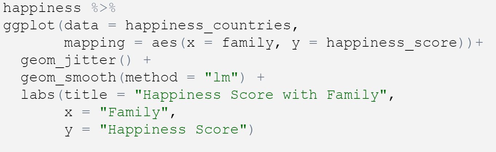
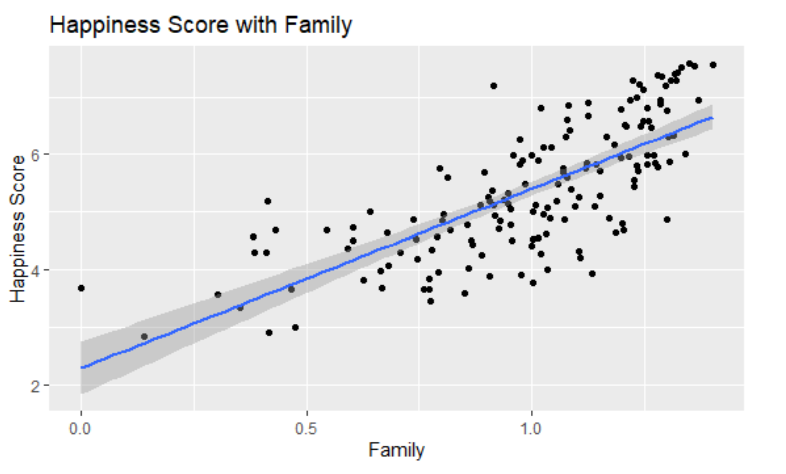

## Research Question

The research question we will be investigating is, 'How  Do a Range of Factors Affect Worldwide Happiness?'. 

It is of interest as it informs and develops an understanding of global wellbeing and development. It focuses on current issues and standards of countries internationally. 

## Hypothesis 

We hypothesise that in countries with higher GDP and freedom rating , the happiness score will be higher than countries with a lower GDP and freedom rating. Therefore the GDP and Freedom Rating  are proportional to the happiness score.

We hypothesise that in countries where Government Corruption is higher, the happiness score will be lower than in countries with less government corruption. Therefore government corruption and happiness score will vary inversely with each other.

## What is the Ranking?

A report based on national happiness, based on citizen ratings of their lives, it correlates results on a number of factors. 

## Data

The dataset we have used is the 2015, World Happiness Ranking. (.csv file)

(Author- Sustainable Development Solutions Network, 2019, _World Happiness Report_, Electronic Dataset, Accessed- 21.10.22, <https://www.kaggle.com/datasets/unsdsn/world-happiness>)

The key variables we will be using are;

- Government Trust, perception of corruption

- Economy, in terms of GDP of the country

- Family

- Freedom 

- Health, the expected life expectancy of the citizens,

and the resulting variable of Happiness Score. 


Another dataset we left joined with our 2015 set was the 'countries of the world' dataset.

(Author- Fernando Lasso, 2017, _Countries of the World_, Electronic Dataset, Accessed- 10.11.22, <https://www.kaggle.com/datasets/fernandol/countries-of-the-world>)

## Findings

**Method**

After analysing our dataset and how different variables can be used we decided to find another data set, _Countries of the World_, and use a left join to join it with our _2015 Happiness Set_. By doing this we have more variables for each individual country, such as population, coast line and population density. We noticed some of our countries had NA values, to resolve this we renamed some of the countries in the _Countries of the World_ dataset, so that they would match up with the _2015_ format of each country. 

We made 5 scatter graphs to show how each of our chosen variables varied with the Happiness Score. To which we then added a linear regression model 

**An Example of our Coding and Graph results**

#try to include an image of code and graph

```{r echo=FALSE}

```

```{r echo=FALSE}

```

**Findings**

Average Happiness Score

- Our calculations have found that the average happiness score of our rated countries is 5.375734 out of a possible 10. This is on a range from highest to lowest, (Switzerland to Togo).

Graph 1: Family vs Happiness Score 

- Our scatter plot has a positive linear correlation, where the association between points is quite strong. Where generally as the Happiness Score increases the Family rating increases to. There are few outliers from the general trend. 


Graph Connections 

- Where some outliers are shown means that no one variable has an entire effect on the Happiness Score and different variables need to be put together as they aren't related to each other. e.g. where one may has a high family rating they may have a lower rating in another variable, determining a change in their overall ranking. 

**Evaluation**

Limitations:

- Somewhat indefinite variables as they are dependent on who was asked for the results. 

- World circumstances, such as war, natural disaster and social circumstances can effect the results given by citizens.

- An individual countries development in the world in terms of economical, social and political factors. This can also make an effect on the citizens but the dataset doesn't take these factors into consideration. 

- Our leading dataset is from 2015, and is therefore seven years old (from 2022), the results may me out of data and different countries could be making developments on the scale. The joined dataset is from 2017 (five years ago), when compared to each other the two year gap will be incorrect for some variables such as population, which may have had growth in the time. 

Resulting Hypothesis:

- Our first hypothesis was that 'countries with higher GDP and freedom rating, the happiness score will be higher than countries with a lower GDP and freedom rating'. We confirm that this is true, as it was shown in the resulting scatter graphs, although the graph does not show them to be directly proportional as the graph does not have a distinct straight line. Our reasoning for this is that some countries have a large number of people in poverty and then higher numbers of the richest people worldwide, known as wealth inequality. 
A country such as South Africa which has a happiness ranking of 113, has also been ranked as one of the countries with the Highest Wealth Inequalities (external source 1)

'Therefore the GDP and Freedom Rating  are proportional to the happiness score.'


The write-up of your project and findings go here. 

Think of this as the text of your presentation with some extra detail to cover what there was not time to discuss in the presentation. This might include any assumptions you made when doing your analysis, any limitations of the work you have done or any ideas you have for future work. Feel free to split this section into subsections to make it easier to read. 


```{r load-data, echo = FALSE}
# load data here, if you like
```

## Presentation

Our presentation can be found [here](presentation/presentation.html).


## References

Dataset 1 -

(Author- Sustainable Development Solutions Network, 2019, _World Happiness Report_, Electronic Dataset, Accessed- 21.10.22)

<https://www.kaggle.com/datasets/unsdsn/world-happiness>

Dataset 2 - 

(Author- Fernando Lasso, 2017, _Countries of the World_, Electronic Dataset, Accessed- 10.11.22)

<https://www.kaggle.com/datasets/fernandol/countries-of-the-world>

External Source 1 - 

(2022, _Wealth Inequality by Country 2022_, Electronic Web Source, Accessed- 25.11.22)

<https://worldpopulationreview.com/country-rankings/wealth-inequality-by-country>